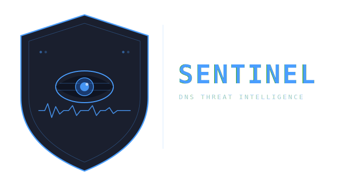

# Sentinel — DNS Threat Intelligence

Sentinel is a lightweight Python daemon that monitors your DNS query log in real time, detects suspicious domains using Shannon entropy analysis, and automatically blocks confirmed threats.

## Versions

| Version | DNS Server | VirusTotal | File |
|---|---|---|---|
| Sentinel Lite | AdGuard Home | ❌ | `sentinel-lite.py` |
| Sentinel Pro | AdGuard Home | ✅ | `sentinel-pro.py` |
| Sentinel Lite Pi-hole | Pi-hole v6 | ❌ | `sentinel-lite-pihole.py` |
| Sentinel Pro Pi-hole | Pi-hole v6 | ✅ | `sentinel-pro-pihole.py` |

## How it works

1. Polls your DNS server's query log every 15 seconds
2. Flags domains with high Shannon entropy (potential DGA/malware domains)
3. *(Pro only)* Verifies flagged domains against the VirusTotal API
4. Automatically blocks confirmed threats in your DNS server

## Requirements

- Python 3.8+
- AdGuard Home **or** Pi-hole v6 instance
- VirusTotal API key *(Pro versions only — free tier supported)*

## Installation

### 1. Clone the repository

```bash
git clone https://github.com/SentinelLabs/sentinel.git
cd sentinel
```

### 2. Install dependencies

```bash
pip install requests python-dotenv --break-system-packages
```

### 3. Configure your .env file

Copy the example file and fill in your credentials:

```bash
cp .env.example .env
nano .env
```

**AdGuard Home versions:**
```env
AGH_URL=http://YOUR_ADGUARD_IP:80
AGH_USER=your_username
AGH_PASS=your_password
VT_API_KEY=your_virustotal_key   # Pro only
```

**Pi-hole versions:**
```env
PIHOLE_URL=http://YOUR_PIHOLE_IP
PIHOLE_PASSWORD=your_pihole_password
VT_API_KEY=your_virustotal_key   # Pro only
```

### 4. Run manually

```bash
python3 sentinel-pro.py
```

---

## Run as a systemd service (recommended)

### 1. Copy the script to /opt

```bash
cp sentinel-pro.py /opt/sentinel.py
cp .env /opt/.env
```

### 2. Create the service file

```bash
nano /etc/systemd/system/sentinel.service
```

Paste the following:

```ini
[Unit]
Description=Sentinel-Pro AdGuard Threat Intelligence
After=network.target

[Service]
Type=simple
WorkingDirectory=/opt
ExecStart=/usr/bin/python3 -u /opt/sentinel.py
Restart=always
RestartSec=10

[Install]
WantedBy=multi-user.target
```

### 3. Enable and start the service

```bash
systemctl daemon-reload
systemctl enable sentinel.service
systemctl start sentinel.service
```

### 4. Check the logs

```bash
systemctl status sentinel.service
journalctl -u sentinel.service -f
```

---

## Configuration

You can adjust these values at the top of the script:

| Variable | Default | Description |
|---|---|---|
| `ENTROPY_THRESHOLD` | `3.8` | Minimum entropy score to flag a domain |
| `SCAN_INTERVAL` | `15` | Seconds between each query log poll |
| `VT_RATE_LIMIT_DELAY` | `15` | Seconds between VirusTotal API calls |
| `MAX_SCANNED_CACHE` | `30000` | Max domains kept in memory cache |

### Whitelist

Add trusted domains to the `WHITELIST` list to prevent false positives:

```python
WHITELIST = [
    "google", "microsoft", "apple", "office", "azure",
    "amazonaws", "tiktok", "netflix", "icloud"
]
```

---

## Getting a VirusTotal API key

1. Create a free account at [virustotal.com](https://www.virustotal.com)
2. Go to your profile → **API Key**
3. Copy the key into your `.env` file

The free tier allows 4 requests/minute — Sentinel Pro handles this automatically.

---

## Security

- Never commit your `.env` file to Git
- The `.gitignore` already excludes it
- Credentials are loaded at runtime via environment variables only

---

## License

MIT License — use freely, contribute welcome.
